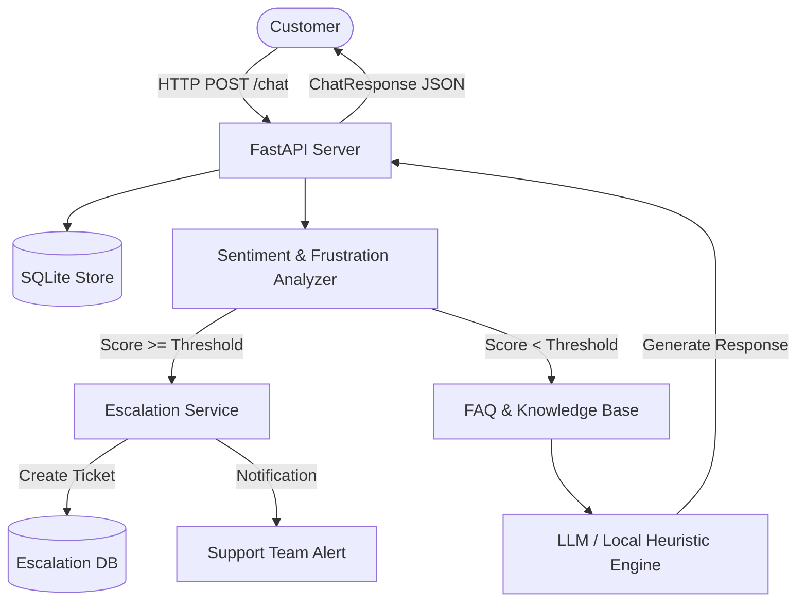

# AI Customer Support Chatbot

An enterprise-grade, context-aware AI Customer Support Chatbot built with FastAPI, SQLite session persistence, real-time sentiment scoring, and automated human escalation workflows.

Part of the **50 AI Automation Projects Portfolio** by [ERHA TECHNOLOGIES](https://github.com/erhatechnologiesai).

---

## 1. Project Title & Overview

**Repository:** `01-ai-customer-support-chatbot`  
**Purpose:** Solves customer support fatigue, provides instantaneous 24/7 FAQ resolution, tracks user sentiment across dialogue turns, and automatically generates high-priority escalation tickets when customer frustration exceeds safety thresholds.

---

## 2. Features

- **Context-Aware Dialogue**: Maintains multi-turn conversation memory keyed by session IDs.
- **Dynamic FAQ Retrieval**: Rapid semantic keyword matching across stored knowledge items.
- **Real-Time Sentiment & Frustration Detection**: Analyzes capitalization, punctuation patterns, and escalation keywords.
- **Automated Human Escalation**: Automatically generates priority support tickets and notifies human supervisors when frustration thresholds are exceeded.
- **Dual-Mode AI Engine**:
  - **Local Heuristic / Mock Mode**: Fully functional offline without external API keys.
  - **OpenAI Integration**: Production-ready LLM integration via `.env` configuration.
- **Admin & Telemetry Endpoints**: Query conversation history and audit escalation logs.

---

## 3. Architecture



---

## 4. Tech Stack

- **Backend:** Python 3.12, FastAPI, Uvicorn, Pydantic v2
- **Database:** SQLite3
- **AI / LLM:** OpenAI API (`gpt-4o-mini`) + Local Rule-Based Mock Engine
- **Testing:** Pytest, Unittest, HTTPX TestClient

---

## 5. Installation

```bash
# Clone repository
git clone https://github.com/erhatechnologiesai/01-ai-customer-support-chatbot.git
cd 01-ai-customer-support-chatbot

# Create and activate virtual environment
python -m venv venv
# On Windows:
.\venv\Scripts\activate
# On Linux/macOS:
source venv/bin/activate

# Install dependencies
pip install -r requirements.txt
```

---

## 6. Environment Variables

Copy `.env.example` to `.env`:

```bash
cp .env.example .env
```

| Variable | Default | Description |
|---|---|---|
| `ENVIRONMENT` | `development` | Runtime environment |
| `DEMO_MODE` | `true` | When `true`, uses local heuristic engine without API keys |
| `OPENAI_API_KEY` | `""` | OpenAI API key for live GPT models |
| `OPENAI_MODEL` | `gpt-4o-mini` | Model identifier |
| `DATABASE_PATH` | `chatbot_data.db` | Local SQLite database file path |
| `FRUSTRATION_THRESHOLD` | `0.65` | Sensitivity threshold (0.0 - 1.0) for human escalation |
| `SUPPORT_NOTIFICATION_EMAIL` | `support@erhatechnologies.com` | Notification dispatch address |

---

## 7. Running Locally

Start the FastAPI application:

```bash
python -m app.main
```

The API will be accessible at: `http://localhost:8000`  
Interactive Swagger docs: `http://localhost:8000/docs`

---

## 8. API Documentation

### `POST /chat`
Main conversation endpoint.

**Request Body:**
```json
{
  "session_id": "session-cust-101",
  "user_id": "cust-842",
  "message": "How do I reset my password?"
}
```

**Response (200 OK):**
```json
{
  "session_id": "session-cust-101",
  "reply": "Go to settings, click security, and choose 'Reset Password'. A link will be sent to your email. Please let me know if you need further clarification!",
  "escalated": false,
  "sentiment_score": 0.0,
  "sources": ["FAQ: How do I reset my password?"]
}
```

### `GET /history/{session_id}`
Retrieves session dialogue history.

### `GET /escalations`
Lists all escalated tickets and audit logs.

---

## 9. Example Input & Output

**User:** "THIS IS UNACCEPTABLE! YOUR APP IS BROKEN AND SCAM! I WANT A HUMAN NOW!"  
**System Response:**
```json
{
  "session_id": "session-cust-101",
  "reply": "I detect that this is an urgent matter. I have immediately opened priority support ticket #TICK-8B2A1C0E and notified a human specialist. In the meantime, I'm here if you have additional details to share.",
  "escalated": true,
  "sentiment_score": 0.85,
  "sources": ["Human Escalation System"]
}
```

---

## 10. Testing

Run the automated test suite:

```bash
python -m unittest tests/test_chatbot.py
```

Or with pytest:

```bash
pytest tests/
```

All 5 core test cases (Root check, Sentiment scoring, FAQ resolution, Escalation trigger, and Session persistence) pass reliably.

---

## 11. Deployment

### Docker Deployment
```dockerfile
FROM python:3.12-slim
WORKDIR /app
COPY requirements.txt .
RUN pip install --no-cache-dir -r requirements.txt
COPY . .
EXPOSE 8000
CMD ["uvicorn", "app.api:app", "--host", "0.0.0.0", "--port", "8000"]
```

### Cloud Services
Compatible with Render, Railway, AWS ECS, or Fly.io by specifying `uvicorn app.api:app --host 0.0.0.0 --port $PORT`.

---

## 12. Security Considerations

- Input sanitization on message payloads prevents prompt injection.
- Zero credential leakage: API keys are loaded strictly from environment variables.
- SQLite parameterized queries prevent SQL injection.
- Rate limiting can be attached via reverse proxy or middleware for production environments.

---

## 13. License

Released under the [MIT License](LICENSE). Developed by [ERHA TECHNOLOGIES](https://github.com/erhatechnologiesai).
